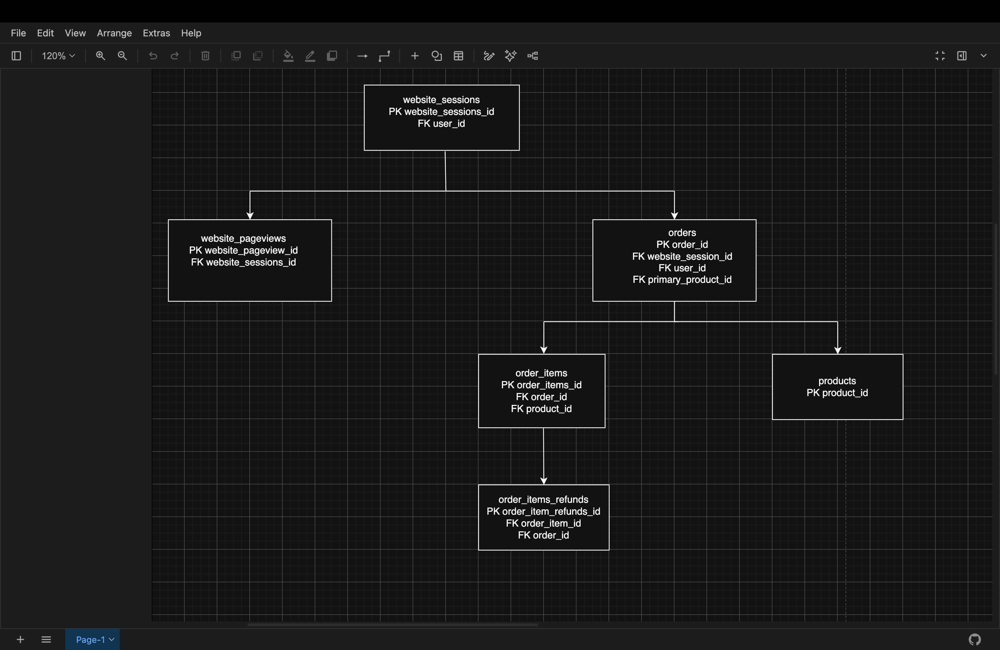
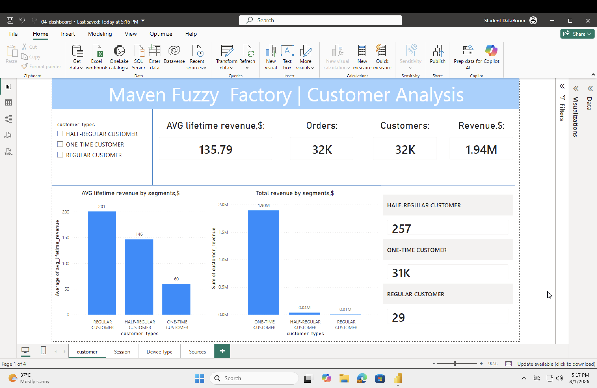
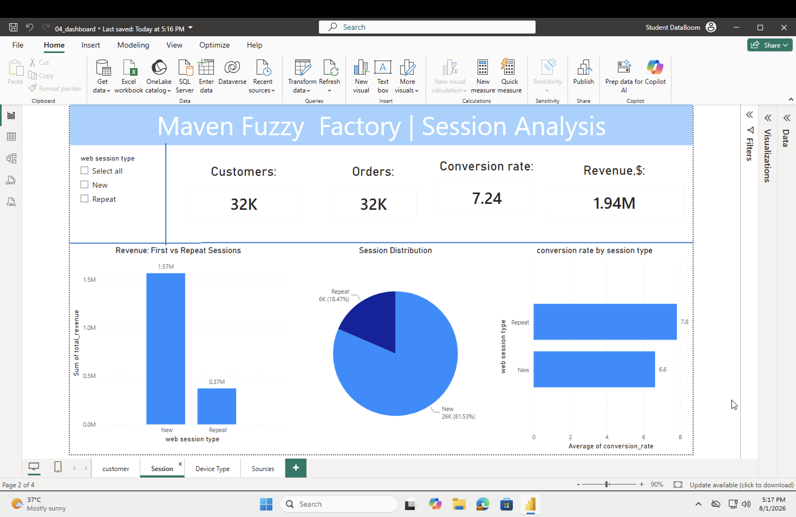
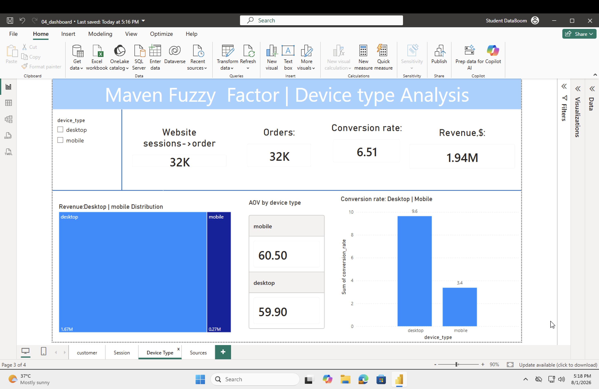
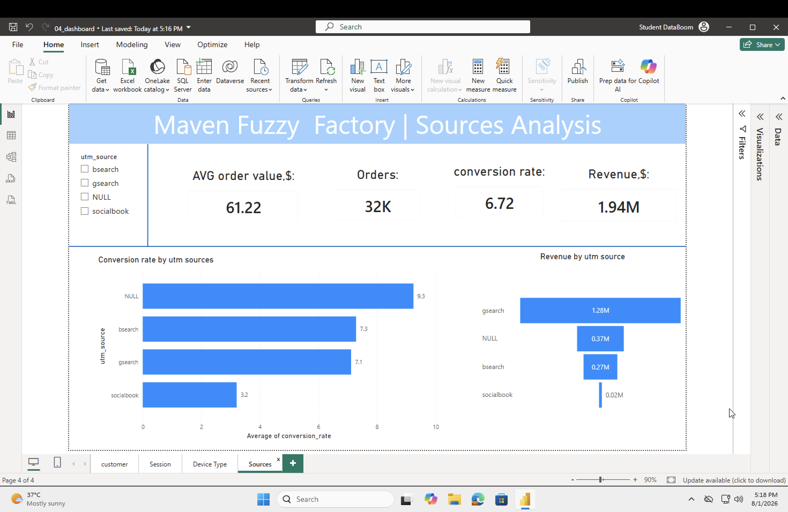
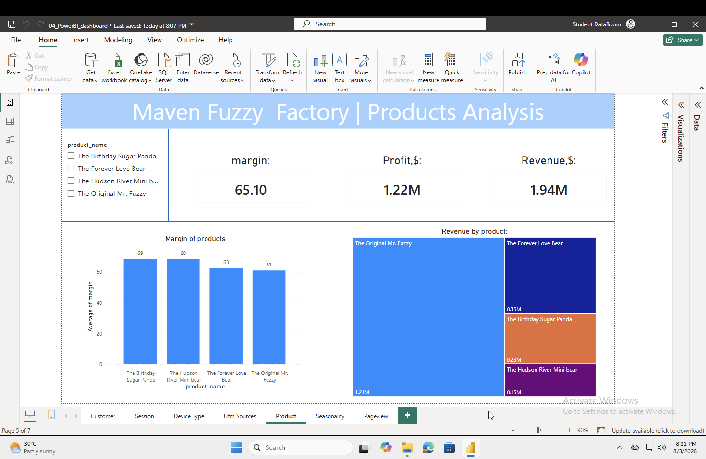
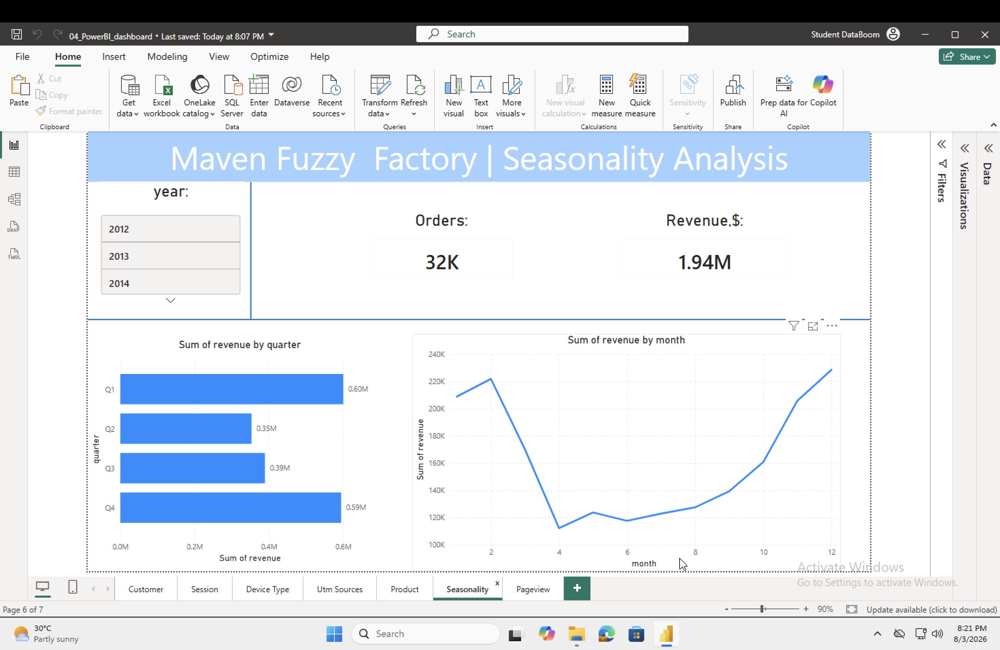
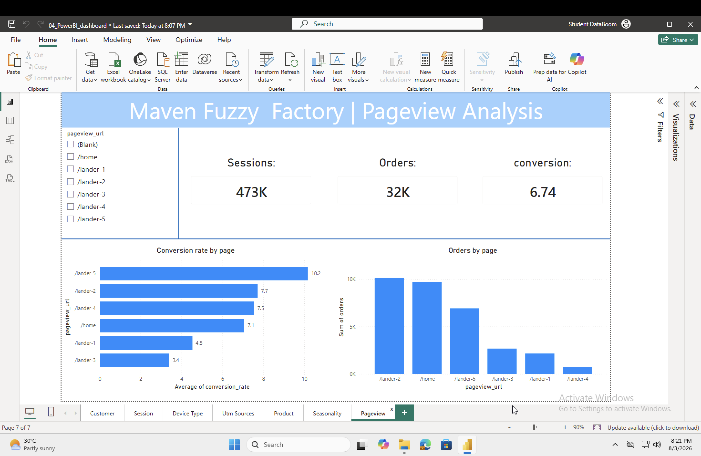

# Maven Fuzzy Factory | End-to-End Customer & Sales Analytics

## Quick Navigation

- [About the Project](#about-the-project)
- [Tech Stack](#-tech-stack)
- [Repository Structure](#repository-structure)
- [Data Diagramm](#data-diagramm)
- [What I did?](#what-i-did)
- [Key Findings](#key-findings)
- [Power BI Dashboard](#-power-bi-dashboard)
- [Business Questions & Answers](#business-questions--answers)
- [Business Recomendations](#business-recommendations)
- [Getting Started](#-getting-started)
- [Project Workflow](#project-workflow)
- [Project Conclusion](#project-conclusion)

## About the Project

This project presents an end-to-end data analytics workflow for **Maven Fuzzy Factory**, an e-commerce company specializing in plush toys.

The objective was to transform raw transactional data into actionable business insights by combining **Python (Pandas)**, **PostgreSQL**, and **Power BI**.

The analysis focuses on answering key business questions related to:

- Customer retention
- Website performance
- Marketing effectiveness
- Device performance
- Product profitability
- Seasonality
- Landing page optimization

The project follows a complete analytics pipeline:

**Raw Data → Data Quality Assessment → Exploratory Data Analysis (EDA) → SQL Business Analysis → Power BI Dashboard → Business Recommendations**

---

# 🛠 Tech Stack

| Category         | Tools            |
|------------------|------------------|
| Programming      | Python           |
| Data Analysis    | Pandas           |
| Notebook         | Jupyter Notebook |
| Database         | PostgreSQL       |
| Visualization    | Power BI         |
| Version Control  | Git & GitHub     |

---

# Repository Structure

```text
project_1/
├── data/
│   ├── orders.csv
│   ├── order_items.csv
│   ├── order_item_refunds.csv
│   ├── website_sessions.csv
│   ├── website_pageviews.csv
│   └── products.csv
│
├── notebooks/
│   ├── 01_data_understanding.ipynb
│   └── 02_EDA.ipynb
│
├── SQL/
│   └── 03_Analysis.sql
│
├── PowerBI/
│   └── 04_PowerBI_dashboard.pbix
│
├── images/
│   ├── Customer Analysis.png
│   ├── Data Diagramm.png
│   ├── Device Type Analysis.png
│   ├── PageView Analysis.png
│   ├── Product Analysis.png
│   ├── Seasonality Analysis.png
│   ├── Session Analysis.png
│   └── Utm sources Analysis.png
│
└── README.md

```
### Data diagramm





---
# What I did?


### 01_data_understanding.ipynb

Initial data quality assessment:

- Missing values
- Duplicate rows
- Primary key validation
- Foreign key validation
- Data types
- Date ranges correctness
- Negative values

---

### 02_EDA.ipynb

Exploratory data analysis including:

- Revenue
- Profit
- Margin
- Refund analysis
- Product performance
- Traffic analysis
- Landing page analysis
- Seasonality
- Business recommendations

---

### SQL

Business-oriented SQL analysis including:

- Customer segmentation
- Repeat customer analysis
- Device performance
- Marketing channel analysis
- Seasonality
- Quarter analysis

---

### Power BI

Interactive dashboard consisting of **7 analytical pages** with dynamic filters and KPIs.

---

# Data Quality Assessment

Before starting the analysis, the raw data was validated.

### Validation Checklist

1.No missing values were detected across al tables

2.No duplicate rows were detected 

3.All primary keys are unique 

4.Data types was reviewed and 'created_at' was convert to the correct data type

5.No negative values were found in 'price_usd' and 'cogs_usd' 

6.Foreign keys relationships are valid

7.Data ranges consistent and does not had future dates,so data ranges correct 


--

### Conclusion

Overall:The datasets passed the initial data quality assessment and are ready for exploratory data analysis (EDA)

---

# Exploratory Data Analysis (EDA)

## Financial Overview

| Metric  | Value       |
|---------|-------------|
| Revenue | **$1.94M**  |
| Profit  | **$1.22M**  |
| Margin  |  **62.74%** |

---

## Key Findings

- **61% of total profit** comes from **Mr. Fuzzy**, creating a significant product concentration risk.

- Refunds cost approximately **$85.3K annually (4.4% of revenue)**, with most losses driven by Mr. Fuzzy.

- Overall conversion rate is **6.83%**, while **bsearch (7.19%)** significantly outperforms **socialbook (3.21%)**.

- Landing page optimization opportunity: **/lander-5 converts at 10.17%** compared to **3.39% for /lander-3**.

---


# SQL Business Analysis

SQL was used to answer business questions through customer segmentation,aggregation,CTE,joins,and conversion calculations.

Main analytical tasks:

- Customer segmentation
- Lifetime revenue calculation
- Customer retention analysis
- Session analysis
- Device analysis
- Traffic source analysis
- Monthly and quarterly revenue trends

---

## Key Findings 

--Improve customer retention: Implement trigger marketing,loyalty programs,and personalized email campaigns,

as the current customer base consists primarily of one-time buyers, and repeat sales are underutilized.


--Optimize Mobile Funnel: Improve user experience (UX/UI) on smartphones to reduce the conversion

gap between mobile (3.37%) and desktop (9.63%).


--Redistribute your advertising budget: Disable the ineffective Socialbook channel with its minimal

conversion rate (3.21%) and use the freed-up funds to scale up GSearch, which consistently generates the largest volume of orders.

--Boost Direct Traffic (Direct / NULL): Invest in Brand Awareness to increase the share of direct traffic,

which has the highest conversion rate (9.25%).

#  Power BI Dashboard

The dashboard contains **7 analytical pages**.

---

## 1️⃣ Customer Analysis

Business Question

> Which customer segments generate the highest business value?

KPIs

- Revenue
- Orders
- Customers
- Average Lifetime Revenue

Visualizations

- Customer segmentation
- Revenue by segment
- Average Lifetime Revenue
- Customer distribution



---

## 2️⃣ Session Analysis

Business Question

> How do new and repeat visitors differ?

KPIs

- Conversion Rate
- Revenue
- Orders
- Customers

Visualizations

- Revenue comparison
- Session distribution
- Conversion by session type



---

## 3️⃣ Device Analysis

Business Question

> Does device type influence purchasing behavior?

KPIs

- Conversion Rate
- Revenue
- Orders

Visualizations

- Desktop vs Mobile revenue
- Average Order Value
- Device conversion rate



---

## 4️⃣ Traffic Sources Analysis

Business Question

> Which acquisition channels perform best?

KPIs

- Average Order Value
- Conversion Rate
- Revenue

Visualizations

- Revenue by source
- Conversion by source



---

## 5️⃣ Product Analysis

Business Question

> Which products drive business performance?

KPIs

- Revenue
- Profit
- Margin

Visualizations

- Revenue by product
- Product margins



---

## 6️⃣ Seasonality Analysis

Business Question

> Are there seasonal sales patterns?

Visualizations

- Revenue by month
- Revenue by quarter



---

## 7️⃣ Landing Page Analysis

Business Question

> Which landing pages convert visitors most effectively?

KPIs

- Sessions
- Orders
- Conversion Rate

Visualizations

- Orders by landing page
- Conversion by landing page



---

#  Business Questions & Answers

## 1. Does the company have a customer retention problem?

**Answer**

Yes.

The vast majority of customers make only one purchase, while repeat customers represent a very small share of the customer base.

The business relies heavily on acquiring new customers instead of retaining existing ones.

---

## 2. Which customer segment generates the highest value?

**Answer**

Regular customers generate the highest lifetime revenue per customer.

Although they represent only a small portion of customers, they provide significantly greater long-term value.

---

## 3. Does session type affect conversion?

**Answer**

Yes.

Repeat sessions convert better than new sessions, indicating that returning visitors are more likely to purchase.

---

## 4. Does device type affect sales?

**Answer**

Yes.

Desktop users convert at approximately **9.6%**, while mobile users convert at only **3.4%**.

This suggests substantial optimization opportunities for the mobile shopping experience.

---

## 5. Which marketing channel performs best?

**Answer**

GSearch generates the largest number of orders and revenue.

Direct traffic (NULL) has the highest conversion rate.

Socialbook performs significantly worse than all other traffic sources.

---

## 6. Is the business dependent on one product?

**Answer**

Yes.

Mr. Fuzzy contributes roughly **61% of total profit**, exposing the company to product concentration risk.

---

## 7. Which landing page performs best?

**Answer**

/lander-5 achieves the highest conversion rate (10.17%), while /lander-3 performs the worst.

---

## 8. Is there seasonality?

**Answer**

Yes.

Sales decrease during Q2 and peak in Q4.

Inventory planning and marketing campaigns should account for these seasonal trends.

---

#  Business Recommendations

### 1. Improve Customer Retention

- Launch loyalty programs
- Implement personalized email campaigns
- Introduce trigger marketing
- Encourage repeat purchases

---

### 2. Optimize Mobile Experience

Desktop conversion is nearly three times higher than mobile.

Recommended actions:

- Improve mobile UX
- Simplify checkout process
- Increase website loading speed

---

### 3. Reallocate Marketing Budget

Reduce investment in Socialbook.

Increase spending on:

- GSearch
- Brand awareness initiatives
- High-performing acquisition channels

---

### 4. Increase Direct Traffic

Direct traffic demonstrates the highest conversion rate.

Invest in:

- Brand recognition
- Email marketing
- Organic customer acquisition

---

### 5. Reduce Product Concentration Risk

Decrease dependence on Mr. Fuzzy by:

- Expanding sales of other products
- Cross-selling
- Product bundling

---

### 6. Improve Product Quality

Investigate refund reasons.

Focus on quality improvements for products with the highest refund rates.

---

### 7. Optimize Landing Pages

Adopt the design principles of **/lander-5** across the website.

Replace or redesign underperforming landing pages.

---

### 8. Prepare for Seasonality

Increase inventory before Q1.

Plan marketing campaigns during lower-demand periods to stabilize revenue.

---

# 🚀 Getting Started

## Clone repository

```bash
git clone https://github.com/yourusername/Maven-Fuzzy-Factory.git
```

## Run Jupyter Notebook

```bash
jupyter notebook
```

Execute:

- 01_data_understanding.ipynb
- 02_EDA.ipynb

---

## PostgreSQL

Import the provided dataset.

Run SQL scripts from the `sql/` folder to reproduce all analytical tables and metrics.

---

## Power BI

Open

```
Maven_Fuzzy_Factory.pbix
```

Refresh the data connection if required.

---

#  Project Workflow

```
Raw Data
      │
      ▼
Data Quality Assessment
      │
      ▼
Exploratory Data Analysis
      │
      ▼
SQL Business Analysis
      │
      ▼
Power BI Dashboard
      │
      ▼
Business Insights
      │
      ▼
Business Recommendations
```

# Project Conclusion

This project demonstrates a complete end-to-end data analytics workflow, starting from raw CSV datasets and ending with actionable business recommendations.

The analysis identified several critical business opportunities:

- Customer retention is the company's primary challenge, as most customers make only one purchase.

- Mobile conversion significantly underperforms desktop, indicating UX optimization opportunities.

- Gsearch is the most effective acquisition channel, while Socialbook delivers poor conversion performance.

- Mr. Fuzzy accounts for 61% of total profit, exposing the business to product concentration risk.

- Landing page optimization and refund reduction could substantially improve profitability.


The project combines Python (Pandas), PostgreSQL, and Power BI to transform raw transactional data into business insights and support data-driven decision-making.